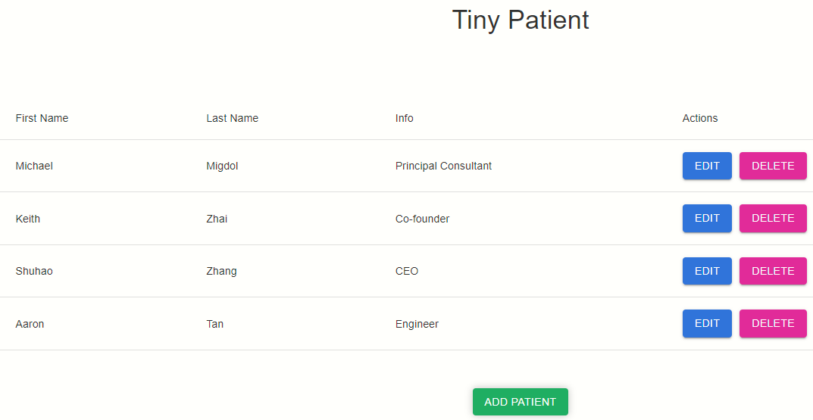
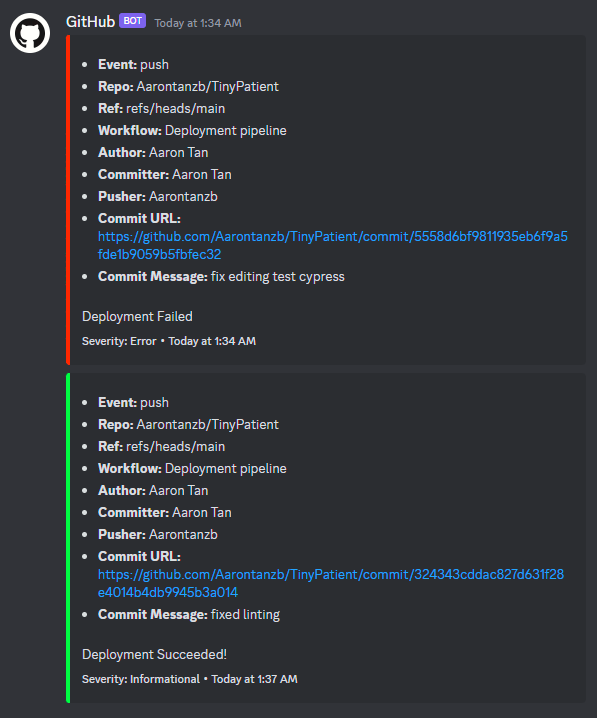

<!-- PROJECT LOGO -->
 

  

<h3 align="center">TinyPatient</h3>

  

    A Full Stack application that allows you to add, edit, and remove patient entries!
     
    <a href="https://github.com/Aarontanzb/TinyPatient"><strong>Explore the docs »</strong></a>
     
     
    <a href="https://tinypatient.netlify.app/">View Demo</a>
  

<!-- TABLE OF CONTENTS -->

  
Table of Contents

  <ol>
    <li>
      <a href="#about-the-project">About The Project</a>
      <ul>
        <li><a href="#built-with">Built With</a></li>
      </ul>
    </li>
    <li>
      <a href="#getting-started">Getting Started</a>
      <ul>
        <li><a href="#installation">Installation</a></li>
      </ul>
    </li>
    <li><a href="#usage">Usage</a></li>
    <li><a href="#license">License</a></li>
    <li><a href="#contact">Contact</a></li>
  </ol>

<!-- ABOUT THE PROJECT -->
## About The Project
`A Full Stack application that allows you to add, edit, and remove patient entries!
Features: 
  CI/CD pipeline with Github Actions that lints, end-to-end tests, and deploys the frontend to Netlify and the backend to Render.
  Automatic Discord notifications for when a build has failed or succeeded.
  Version control with tags.
  `

(<a href="#readme-top">back to top</a>)

### Built With

* [MongoDB]
* [Express.js]
* [React]
* [Node.js]
* [Typescript]
* [Render]
* [Netlify]
* [Cypress]
* [Github Actions]
* [Discord Webhooks]
* [React Material UI]

(<a href="#readme-top">back to top</a>)

<!-- GETTING STARTED -->
## Getting Started

No installation required! Just head over to
https://tinypatient.netlify.app/

To get a local copy up and running follow these simple steps.
1. Clone the repo
2. Install dependencies in both the frontend and backend folders
3. Run the backend test server
4. Run the frontend test server
3. Run the backend server
4. Run the frontend server
5. Enjoy!

(<a href="#readme-top">back to top</a>)

<!-- USAGE EXAMPLES -->
## Usage

Demo

Notifications

(<a href="#readme-top">back to top</a>)

<!-- LICENSE -->
## License

Distributed under the MIT License. See `LICENSE.txt` for more information.

(<a href="#readme-top">back to top</a>)

<!-- CONTACT -->
## Contact

Aaron - https://linkedin.com/in/tzb-aaron - tan.zb@u.nus.edu 

Project Link: [https://github.com/Aarontanzb/TinyPatient](https://github.com/Aarontanzb/TinyPatient)

(<a href="#readme-top">back to top</a>)

